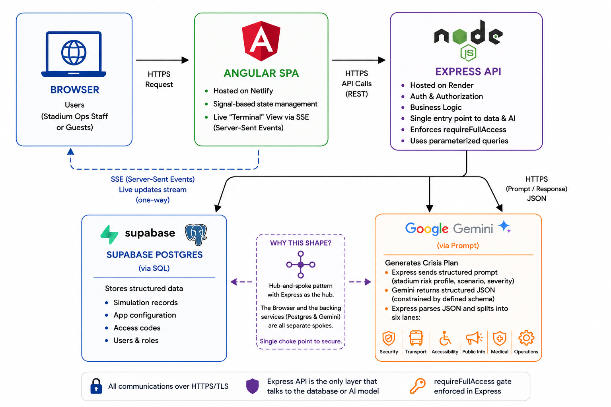

# StadiumPulse — FIFA Nexus Twin


A GenAI-powered crisis simulation and command dashboard for FIFA World Cup 2026 venue operations staff.

**Live app:** https://fifa-nexus-twin.netlify.app

## Chosen Vertical

**Smart Event & Venue Operations Assistant.** StadiumPulse is built for the persona of a **Stadium Operations Command Center staff member** during a live World Cup 2026 match — someone who needs to detect, simulate, and coordinate a multi-agency response to a crisis unfolding in real time (crowd surges, weather events, transit gridlock, structural incidents) across any of the tournament's 16 real stadiums in the US, Mexico, and Canada.

## Approach and Logic

The core problem: when a crisis event begins at a stadium, an ops team needs an **instant, coordinated, multi-department response plan** — not a slow committee decision. StadiumPulse acts as that response assistant:

1. **Context grounding** — every one of the 16 real World Cup stadiums has embedded static risk-profile data (altitude, seismic zone, extreme heat, hurricane exposure, transit chokepoints, etc.), and every crisis scenario is scoped to only the stadiums where it's realistically relevant (e.g. `stormInundation` won't trigger at a domed, inland stadium). Each match's live/completed/upcoming status — and the stadium's own live-indicator on the map — is derived by comparing its date to the real server clock, not a hand-maintained flag, so "today's match" is always correct without manual updates.
2. **Dynamic decision generation** — when an operator triggers a scenario, the backend calls Google's Gemini model (`gemini-2.5-flash`) with the stadium's real risk profile and the scenario context, and asks it to return a structured response plan across simultaneous operational lanes: navigation/crowd routing, security and crowd control, accessibility guidance, transport updates, sustainability/energy actions, and multilingual public-address scripts (EN/ES/FR).
3. **Escalation logic** — each scenario has a defined escalation path (e.g. `exitSurge → crowdCrush`) so operators can simulate a worsening situation and see how the AI-generated response changes as severity increases.
4. **Live operational feed** — responses stream back over Server-Sent Events into a real-time "command terminal" UI, so the dashboard feels like an actual live ops console rather than a static form submission.

This is "logical decision making based on user context" applied literally: the AI's output is conditioned on which physical stadium, which crisis type, and which severity/escalation state the operator is in — not a generic chatbot response.

## How the Solution Works

**Architecture:** Angular 21 (frontend) + Node/Express (backend) + PostgreSQL (Supabase-hosted), talking to Google's Gemini API.



- **Backend (`server/`)** — Express REST API with route/controller/service layering:
  - `auth` — a lightweight, dependency-free access-code gate using Node's built-in `crypto` for signed session tokens (no external JWT library). Two session tiers: a full-access `ops_staff` token (requires the access code) and a read-only `guest` token (no code required) — a `requireFullAccess` middleware blocks guests from write routes (triggering, escalating, changing the access code) while reference/history reads stay open to both
  - `reference` — serves the 16 stadiums, match schedule, and crisis scenario catalog
  - `simulation` — triggers a Gemini-backed crisis response (sync or streaming), stores results in Postgres, supports escalation and history lookup
  - Rate-limited endpoints, scenario whitelisting, and idempotent DB migrations that seed sample data only on first boot
- **Frontend (`client/`)** — standalone Angular components with Signal-based state stores (`simulation.store.ts`, `stadium.store.ts`):
  - Interactive SVG stadium schematic showing live routing/flood/gridlock overlays
  - A "cyberpunk terminal" console rendering the AI's streamed JSON response live
  - Scenario control deck, agency response panels, PA broadcast/signage preview, and a QR-dispatch overlay dialog for field staff
  - A public, unauthenticated mobile "staff card" view (`/staff/:crisisId/:role`) — the QR code shown on the ops dashboard encodes a link to this page, so ground staff scan it with their own phone to get their role-specific directive, without needing the ops access code
  - Accessibility toggle for high-contrast mode and adjustable text scale, plus app-wide ARIA labeling, live regions, focus-trapped dialogs, skip-to-content link, and `prefers-reduced-motion` support
  - "Continue as Guest" on the login screen for a read-only session — reference data, match schedule, and simulation history are all viewable, but trigger/escalate/predict and changing the access code are disabled with an explanatory note, enforced server-side
  - The live-match ticker keeps operators focused on the crisis-response workflow rather than duplicating a live scoreboard

**Testing:** 38 backend tests (Jest + Supertest) and 260 frontend tests (Karma/Jasmine) covering auth (including the guest role), all API endpoints, date-derived match/stadium status, guards, interceptors, state stores, and every UI component (including dialog focus/keyboard behavior).

**Security & efficiency hardening:** constant-time comparison for access-code/token checks (prevents timing attacks), `helmet` security headers, request body size limits, and DB indexes on the simulation history table's sort/filter columns with a capped result size.

**Deployment:**
- Backend on Render (connected to a Supabase Postgres instance), auto-deployed via a GitHub Actions workflow that pings Render's deploy hook on every push to `main` touching `server/`.
- Frontend on Netlify, built from `client/` per `netlify.toml`, with an SPA rewrite for client-side routing.
- A separate GitHub Actions workflow (`test.yml`) runs both test suites on every push/PR to `main` — see the badge above.

## Assumptions Made

- Match schedule, stadium risk profiles, and tournament dates are illustrative/researched data for demo purposes, not official FIFA data feeds. Each match's status (completed/live/upcoming) is computed from its date vs. the real server clock, so it stays accurate day to day without manual edits.
- A single shared access code (rather than per-user accounts/roles) is sufficient to represent "authenticated ops staff" for this demo — real deployment would need per-user identity and role-based access.
- `MOCK_MODE` is available to demo the full UI/response flow without live Gemini API calls, for reviewers without an API key or to conserve quota.
- The crisis scenarios and their agency response categories (navigation, security, accessibility, transport, sustainability) are modeled on publicly documented stadium emergency-operations practices, not a specific real FIFA Emergency Action Plan document.

## The Prompt

This project was built using Antigravity with Gemini Flash and Claude Sonnet (free tier). This is the prompt for building it:

```
Build "StadiumPulse" — a GenAI-powered crisis simulation and command dashboard for
FIFA World Cup 2026 stadium operations staff.

VERTICAL & PERSONA
The user is a Stadium Operations Command Center staff member during a live match.
When a crisis unfolds (crowd surge, extreme weather, transit gridlock, structural
incident), they need an instant, coordinated, multi-agency response plan — not a
slow committee decision.

STACK
- Frontend: Angular (latest major), standalone components, Signal-based state
  (no NgRx), Tailwind CSS.
- Backend: Node.js + Express, layered as routes -> controllers -> services -> models.
- Database: PostgreSQL, accessed via the `pg` pool with parameterized queries only
  (no ORM). Idempotent SQL migrations that run automatically on boot, seeding
  sample data only if the table is empty.
- AI: Google Gemini (structured JSON-schema output), with a MOCK_MODE fallback
  that returns static canned responses when no API key is available.
- Auth: no external JWT library — a single shared access code, verified server-side,
  issuing a short-lived signed token via Node's built-in `crypto` module. Also
  support a no-code "guest" login issuing a read-only token, so public visitors
  can explore without the access code while write actions stay code-gated.

DATA MODEL
- 16 real World Cup stadiums (US/Mexico/Canada) with embedded risk-profile data:
  altitude, seismic zone, extreme heat, hurricane exposure, transit chokepoints, etc.
- A crisis scenario catalog, each scenario scoped to only the stadiums where it's
  realistically relevant (e.g. a flood scenario shouldn't trigger at a domed,
  inland stadium), with a defined escalation path to a more severe scenario.
- A `simulations` table storing each triggered response, with stadium/match
  linkage, severity, escalation lineage, and a timeline of events.

CORE BEHAVIOR
- When an operator triggers a scenario for a stadium, call the AI with the
  stadium's real risk profile and the scenario context. Force it to return a
  structured plan across simultaneous operational lanes: crowd navigation,
  security/crowd control, accessibility guidance, transport updates,
  sustainability/energy actions, and multilingual public-address scripts
  (at least English, Spanish, French).
- Support escalation: re-running a scenario at higher severity should produce a
  visibly different, more urgent response, and be linked to the prior record.
- Derive each match's live/completed/upcoming status (and each stadium's own
  live-indicator) from comparing its scheduled date to the real current date at
  request time — never hardcode "today's match" as a static field, since that
  requires a manual edit every single day to stay correct.
- Stream the AI response back over Server-Sent Events into a live "command
  terminal" UI element, not just a static form result.
- Add a public, unauthenticated mobile view (e.g. `/staff/:id/:role`) that ground
  staff can reach without the ops access code — the main dashboard should let an
  operator generate a QR code (as a real overlay dialog, not an inline element)
  that encodes a link to that public view, so staff scan it with their own phone.

NON-FUNCTIONAL BAR
- Testing: unit/integration tests for every backend endpoint (auth, all CRUD/
  trigger/streaming routes, error paths) and every frontend component, service,
  guard, interceptor, and state store.
- Security: parameterized queries only; constant-time comparison for any secret/
  token check; standard HTTP security headers; request body size limits;
  sanitized error responses that never leak stack traces to the client.
- Accessibility: ARIA labels on icon-only controls, live regions on streaming/
  updating content, real dialog semantics (role="dialog", focus trap, Escape to
  close, focus returns to the trigger element) on any modal, status conveyed as
  text not just color, a skip-to-content link, and `prefers-reduced-motion`
  support.
- Efficiency: indexes on any DB column used for sorting/filtering at scale, and
  cap unbounded queries (e.g. history endpoints) instead of returning full tables.

DEPLOYMENT
- Backend on a Node-hosting platform (e.g. Render) connected to a managed
  Postgres instance (e.g. Supabase), with environment variables for the database
  URL, AI API key, and access code — fail fast at boot if any are missing. CORS
  should read the allowed frontend origin from an environment variable rather
  than being hardcoded.
- Frontend on a static host (e.g. Netlify/Vercel) with an SPA rewrite rule for
  client-side routing, and the production environment file wired up via the
  build tool's file-replacement mechanism so the production build actually
  points at the deployed backend.
- A CI workflow that runs both test suites on every push/PR, separate from
  whatever triggers the actual deploy.
```

## Local Setup

```bash
# Backend
cd server
npm install
# create a .env with DATABASE_URL, GEMINI_API_KEY, ACCESS_CODE
npm start

# Frontend
cd client
npm install
ng serve
```

## Running Tests

```bash
# Backend — Jest + Supertest (38 tests)
cd server
npm test

# Frontend — Karma + Jasmine, headless Chrome (260 tests)
cd client
npx ng test --watch=false --browsers=ChromeHeadless
```

Both suites also run automatically on every push/PR to `main` via the GitHub Actions workflow linked in the badge at the top of this file.
